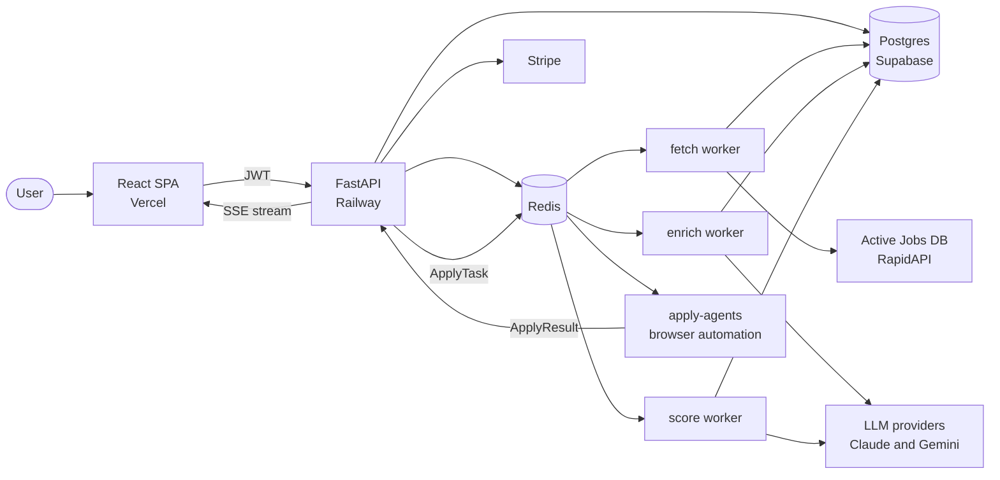

<h1 align="center">AutoApply</h1>

<p align="center">
  <strong>An AI job-application platform.</strong><br/>
  Ingests live job postings, scores them against your profile with an LLM, and submits
  applications autonomously through browser agents — with a full tracking dashboard on top.
</p>

<p align="center">
  <a href="https://github.com/elbin0324/auto-apply/actions/workflows/ci.yml"></a>
  
  
  
  
  
  
  
</p>

---

## Overview

AutoApply automates the highest-friction part of a job search: finding roles worth applying to,
and actually applying to them.

A scheduled worker pulls postings from a live jobs API, a second worker enriches sparse listings
with an LLM, and a third scores every posting against the user's structured profile. Matches above
threshold are pushed to a Redis queue, where browser-automation agents pick them up, complete the
employer's ATS form, and report the result back. The user watches the whole thing happen from a
React dashboard that streams updates over SSE.

This repository is the **platform** — API, data model, background workers, billing, and web client.
The browser-automation agents that consume its task queue live in a companion repository
(`apply-agents`), which communicates with this service over an authenticated internal API.

### At a glance

| | |
|---|---|
| **Backend** | ~15,500 lines of Python — 12 routers, 70 endpoints, 9 SQLAlchemy models, 14 migrations |
| **Frontend** | ~24,200 lines of TypeScript/TSX — 15 pages, 13 feature component domains |
| **Workers** | 3 Redis queue consumers + 2 scheduled cron services |
| **Tests** | 353 tests across 16 suites, `pytest-asyncio` in auto mode, no network required |
| **Deployed on** | Railway (API + workers, Docker) and Vercel (SPA) |

---

## Architecture



### Request flow

FastAPI routers to service layer to async SQLAlchemy models to Supabase Postgres. Every database
operation in the request path is `async`; there is no synchronous SQLAlchemy in a route handler.

### Worker model

All three workers extend a generic `BaseWorker[T]` that implements the pop-process-retry loop,
heartbeat reporting, dead-letter queueing, and structured logging, so each concrete worker only
supplies its task type and its processing function.

| Worker | Job |
|---|---|
| `fetch` | Pulls postings from the jobs API, normalizes locations and industry taxonomy, applies progressive filter relaxation when a query returns nothing |
| `enrich` | Fills in sparse job descriptions via LLM |
| `score` | Scores each posting against the user's profile — LLM-backed, with a heuristic scorer as fallback |

### Pluggable LLM layer

`infra/llm_service.py` defines an `LLMProvider` interface with `AnthropicProvider`,
`GeminiProvider`, and `OpenAICompatProvider` implementations, so the scoring and enrichment
workers can swap models per deployment without touching business logic.

---

## Features

- **Resume parsing** — PDF upload, `pdfplumber` extraction, LLM pass, structured profile JSON
- **Smart job matching** — LLM scoring against title, seniority, location, salary, and industry preferences, with a per-user config scope applied consistently across listing, matching, and scoring
- **Autopilot** — configurable thresholds and daily caps that drive automatic submission
- **Application tracking** — per-application status, ATS platform, failure reason, and match breakdown
- **Live updates** — server-sent events push application state changes to the dashboard
- **Billing** — Stripe subscriptions with plan gating and usage metering
- **Admin tooling** — internal views for queue depth, worker heartbeats, and DLQ inspection

---

## Tech stack

| Layer | Choices |
|---|---|
| **API** | FastAPI, Pydantic v2, Pydantic Settings |
| **Data** | SQLAlchemy 2 (async), asyncpg, Alembic, Supabase Postgres |
| **Queue / cache** | Redis — `RPUSH`/`LPOP` task queues, heartbeats, DLQ |
| **AI** | Anthropic Claude, Google Gemini, pluggable provider interface |
| **Auth** | Supabase JWT (users), shared-secret header (service-to-service) |
| **Payments** | Stripe |
| **Frontend** | React 19, Vite 7, TypeScript 5.9, Tailwind CSS 4, shadcn/ui, Radix |
| **Client state** | TanStack Query, TanStack Router, Zustand, React Hook Form + Zod |
| **Observability** | Sentry, structured JSON logging, worker heartbeats |
| **Infra** | Docker, Railway, Vercel |

---

## Repository layout

```
backend/
  main.py             App factory; mounts all routers under /api
  config.py           Pydantic Settings, lru_cached singleton
  deps.py             DI: CurrentUser, AdminUser, DbSession, internal-key guard
  routers/            health auth profile jobs auto_apply dashboard
                      applications sse admin billing
  services/           Business logic — auto_apply, queue, resume_parser,
                      application, billing, ats_registry, job_scope
  workers/            fetch / enrich / score + BaseWorker, queues, services
  infra/              redis_pool, task_queue, dlq_service, worker_heartbeat,
                      llm_service, event_publisher, logging_config
  models/             SQLAlchemy models (9)
  schemas/            Pydantic request/response schemas
  db/migrations/      Alembic revisions
  tests/              pytest suites

frontend/
  src-v2/
    pages/            15 route-level pages incl. landing, dashboard, autopilot
    components/       Feature domains + shadcn/ui primitives
    hooks/            TanStack Query data hooks
    stores/           Zustand auth store
    lib/              API client (auto-attaches JWT), Supabase client
    theme/            Design tokens

deploy/               Per-service Railway configs
docs/                 Design system, component library, API reference, specs
```

---

## Getting started

### Prerequisites

- Python 3.12+ and [Poetry](https://python-poetry.org/)
- Node 20+ and [pnpm](https://pnpm.io/)
- Docker (for local Redis)
- A Supabase project, and an API key for your chosen LLM provider

### Setup

```bash
git clone https://github.com/elbin0324/auto-apply.git
cd auto-apply

make install      # backend (Poetry) + frontend (pnpm) dependencies
make services     # start Redis via Docker Compose
make migrate      # apply Alembic migrations
```

### Configure environment

```bash
cp backend/.env.example backend/.env
cp frontend/.env.example frontend/.env.local
```

| File | Required values |
|---|---|
| `backend/.env` | `DATABASE_URL`, `REDIS_URL`, `SUPABASE_URL`, `SUPABASE_ANON_KEY`, `SUPABASE_SERVICE_ROLE_KEY`, `ANTHROPIC_API_KEY`, `INTERNAL_API_KEY` |
| `frontend/.env.local` | `VITE_API_URL`, `VITE_SUPABASE_URL`, `VITE_SUPABASE_ANON_KEY` |

> `SUPABASE_SERVICE_ROLE_KEY` bypasses row-level security. It is server-only — never expose it to
> the frontend or write it to logs.

### Run

```bash
make dev            # API on :8000
make fe-dev         # SPA on :5173

make fetch-worker   # each worker runs as its own process
make score-worker
make enrich-worker
```

`make help` lists every target.

---

## Development

### Testing

```bash
make test                                 # full backend suite
make test-file F=test_auth                # one file
make test-one  F=test_auth T=test_health  # one test
```

Tests drive the app through the FastAPI `TestClient`. External dependencies — Supabase auth, Redis,
LLM providers — are patched with `unittest.mock`, so the suite runs with no network and no
credentials.

### Code quality

```bash
make lint        # ruff + eslint
make format      # ruff format + prettier
make typecheck   # tsc --noEmit
```

- **ruff** — `line-length = 100`, targeting `py312`, with `E,F,I,UP,N,S,B,A,C4,T20,RET,SIM` enabled
- **mypy** — strict mode
- **Frontend** — ESLint + Prettier + TypeScript strict

### Conventions

Branches are cut from the mainline as `feat/`, `fix/`, `chore/`, or `hotfix/`. Commits follow
`<type>: <description>`. Every change lands with a `CHANGELOG.md` entry — see
[CHANGELOG.md](CHANGELOG.md) for the running history.

---

## Deployment

The backend ships as a single Docker image (`backend/Dockerfile`, multi-stage on `python:3.12-slim`)
deployed to Railway as five services sharing that image, each pointed at its own config in
[`deploy/`](deploy/):

| Service | Config |
|---|---|
| API | `deploy/api.railway.toml` — health check at `/api/health` |
| Score worker | `deploy/score-worker.railway.toml` |
| Fetch worker | `deploy/fetch-worker.railway.toml` |
| Fetch cron | `deploy/fetch-cron.railway.toml` |
| Reaper cron | `deploy/reaper-cron.railway.toml` |

The frontend builds with Vite and deploys to Vercel as an SPA (`frontend/vercel.json` rewrites all
paths to `index.html`).

---

## Security notes

- All user-facing endpoints require a verified Supabase JWT via the `CurrentUser` dependency
- Agent callbacks authenticate with an `X-Internal-API-Key` header, not a user JWT
- The service-role key is never sent to the client or written to logs
- `.env` files are gitignored and have never been committed

---

## Contributors

AutoApply is built by two people. Per-commit attribution is preserved in full — `git shortlog -sne`
shows exactly who wrote what.

### Jay Shin ([@elbin0324](https://github.com/elbin0324)) — co-founder

Owns the product surface: the marketing site and the design language the application is built in.

- **Landing page** — 21 components, ~2,100 lines in [`frontend/src-v2/components/landing/`](frontend/src-v2/components/landing/): hero with an animated live-dashboard preview, scroll-reveal feature sections, logo marquee, testimonials, pricing with FAQ, and CTA
- **Design system** — the dark, glassmorphic visual language: color and type scales, the shared `cubic-bezier(0.16, 1, 0.3, 1)` easing curve, and the animation vocabulary, specified in [`docs/landing-page-design-spec.md`](docs/landing-page-design-spec.md) and implemented as tokens in `frontend/src-v2/index.css` and `frontend/src-v2/theme/`
- **Product direction** — feature scope, page structure, and positioning

### Andy Craig ([@AndyCraig200](https://github.com/AndyCraig200)) — co-founder

Owns the platform: FastAPI service, data model, the three-worker Redis pipeline, LLM scoring and
enrichment, billing, and deployment infrastructure.

---

## License

Proprietary — all rights reserved. Published publicly for portfolio and code review.
See [LICENSE](LICENSE).
